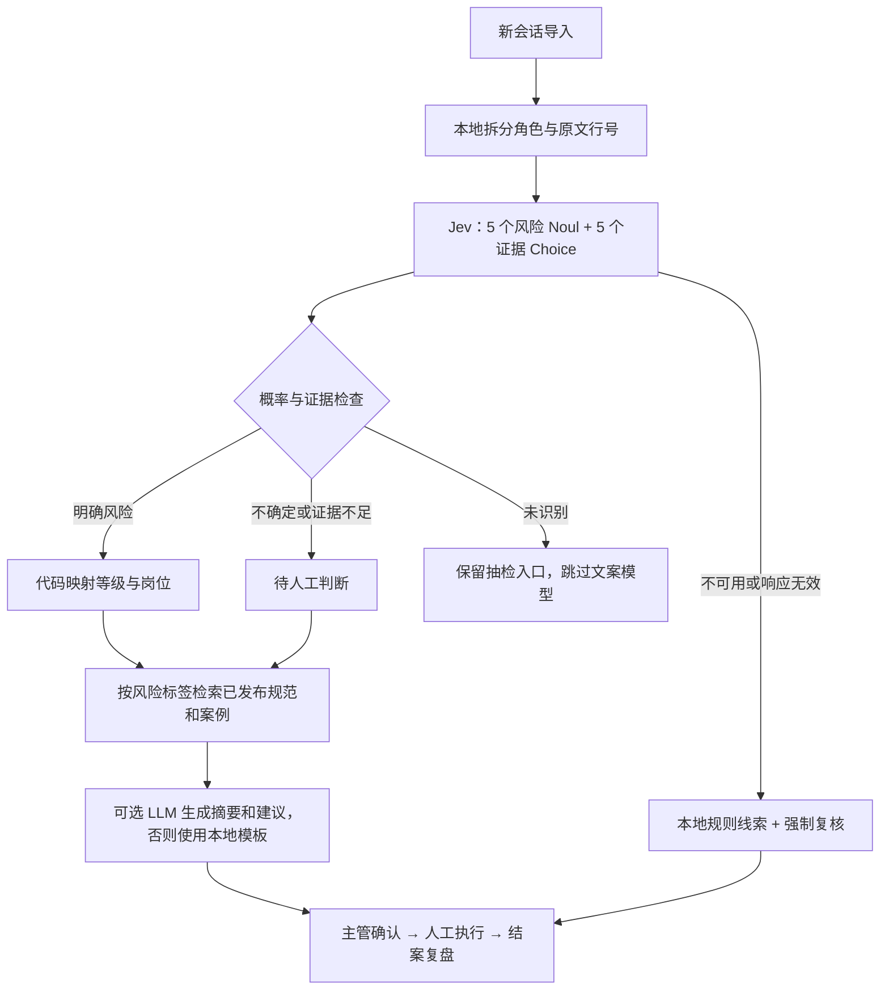

# Qalio 的 Jev 接入

## 设计取舍

Jev 用来回答有确定类型的问题，生成式 LLM 用来撰写摘要和处置草案。借鉴官方案例的方法，而非复制一套与客诉流程无关的演示：

- [官方 SDK 工单分类示例](https://docs.typesafe.ai/sdk/python)：把一个客服输入拆成独立问题。
- [Line-by-line search](https://docs.typesafe.ai/cookbooks/semantic_find)：Noul 判断是否存在，Choice 从给定行号定位原文；该案例附有 Playground 分享入口。
- [Noul 不确定分流](https://docs.typesafe.ai/cookbooks/consistency_noul_cookbook)：保留概率，中间区间交人工。
- [Confidence](https://docs.typesafe.ai/confidence)：Noul 的 P(true) 与 Choice 的分布置信度是不同含义。

本次无法直接打开控制台 Playground（返回 403），以上参考来自官方公开文档及配套案例。没有复制无法访问的控制台示例内容。

## 处理路径



1. 每个风险独立判断，因此同一会话可同时包含退款、履约和情绪风险，不会被单选分类丢失。
2. 证据只能选择程序提供的行号或 NONE，展示时由本地代码恢复原文。越权承诺与服务规范缺失只提供客服行号。真实原文不等于真实违规，语义是否支持仍由主管核查。
3. 未命中与无法判断分开。Noul ≤ 0.30 且 Choice=NONE 才判为未识别；Noul ≥ 0.80、有效原文和 Choice confidence ≥ 0.60 才形成风险线索。其他组合，包括两个独立问题矛盾，都要求复核。
4. Jev 成功后不合并旧关键词结果，避免重新引入否定句误报。旧规则只保留为未启用 Jev 的兼容路径或失败时的可见线索。
5. P0/P1/P2、负责人及执行权限仍由现有代码控制。未新增模型自动退款或自动审批；没有为这些确定性规则增加多余的 Score 调用。
6. 生成模型仅能返回 summary、suggestion、source_ids，不能通过结构化字段修改标签。引用 ID 必须来自实际召回知识；这只验证引用存在，不证明建议在语义上正确，仍需人工确认。

## 配置与运行

安装 `requirements-jev.txt`（固定 `typesafe-sdk==0.7.2`）并设置 `QA_ENABLE_JEV=true`、`TYPESAFE_API_KEY`。默认 `QA_JEV_MODEL=jev-latest`；需可复现实验时改为账号支持的固定模型版本。服务端环境读取密钥，不会发到前端或写入分析记录。

| 参数 | 默认值 | 含义 |
| --- | --- | --- |
| QA_JEV_NEGATIVE_THRESHOLD | 0.30 | 未识别概率上界 |
| QA_JEV_POSITIVE_THRESHOLD | 0.80 | 风险概率下界 |
| QA_JEV_EVIDENCE_CONFIDENCE | 0.60 | 原文定位置信度下界 |
| QA_ENABLE_LLM | false | 风险/不确定会话是否生成文案 |

必须满足 `0 < negative < positive < 1`，证据门槛在 `[0,1]`。非法配置、缺少 SDK 或密钥、HTTP 失败、缺少答案、非法概率和非法证据均进入可见降级。TypeSafe 请求 HTTP 超时为 20 秒、关闭 SDK 自动重试；这是 HTTP 超时设置，不是整个 CSV 导入的总期限。导入仍按现有路径逐条分析。

单条会话最多提供 254 个非空原文行，加 NONE 共 255 个 Choice 选项。超限不静默截断，转本地线索并强制人工复核。当前未实现长会话分块分析。

未配置生成模型时，摘要仍是本地用户话语截取，建议为规范模板，不能称作 Jev 生成。未识别风险的会话也保留本地摘要。

## 留痕与隐私

SQLite 保留实际/请求模型、rubric 版本、门槛、逐标签概率与判断、证据行号与置信度、调用耗时、提供给 Jev 的规范内容与版本。旧记录不重算；初始模拟会话始终在本地生成，只有新导入走配置的外部服务。

调用 Jev 会发送完整会话和最多四条召回的已发布规范，不发送独立的客户名称、客服名称或整个数据库。会话正文可能仍包含个人信息；本次未实现自动脱敏和原文加密。调用生成式 LLM 时还发送该会话、Jev 判断与召回知识。请使用模拟数据验证；不要把 SDK 调试级请求正文日志作为业务日志保存。

当前召回仍是标签与词汇排序，不是向量搜索，也没有宣称实现 Jev 重排。规范覆盖不足、中文场景效果和门槛适用性仍需要业务数据评测。

## 验证

```powershell
.\.venv\Scripts\python.exe -m pip install -r requirements-jev.txt -r requirements-dev.txt
.\.venv\Scripts\python.exe -m unittest discover -s tests -v
node --check static/app.js
```

`tests/test_jev.py` 使用官方 SDK 和模拟 HTTP transport，检验实际 SDK 序列化/响应解析；不会调用收费服务。覆盖判断、证据角色限制、概率门槛、不确定分流、异常降级、生成失败、初始化不外发、结果重启持久化与主管复核门槛。不安装可选 SDK 时，相应测试明确标记跳过。

上线前应使用人工标注的会话比较规则、Jev、Jev+LLM 的多标签精确率/召回率、证据正确率、人工复核比例、端到端耗时及成本。特别包含否定句、用户引用承诺、多个问题、缺少授权规范、长会话等样本。密钥需在运行环境单独配置；目前尚无真实在线调用或准确率、速度、成本改善的实测结论。
